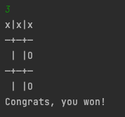

# Java TicTacToe

This project was made to practice using Java, It is a simple command line app for TicTacToe against a computer.

## Installation

To try it out, clone the repository and run it!  You can make selections 1-9 in the terminal to decide your position.